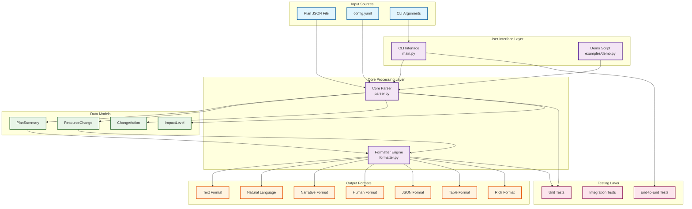
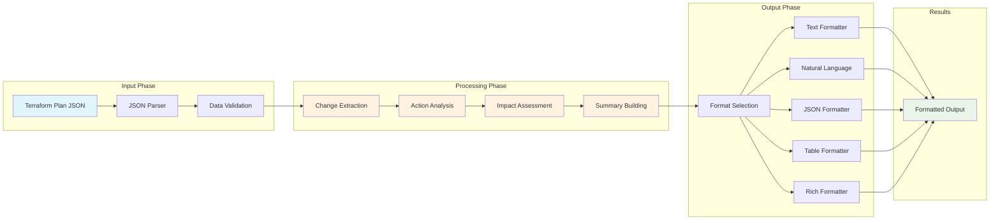
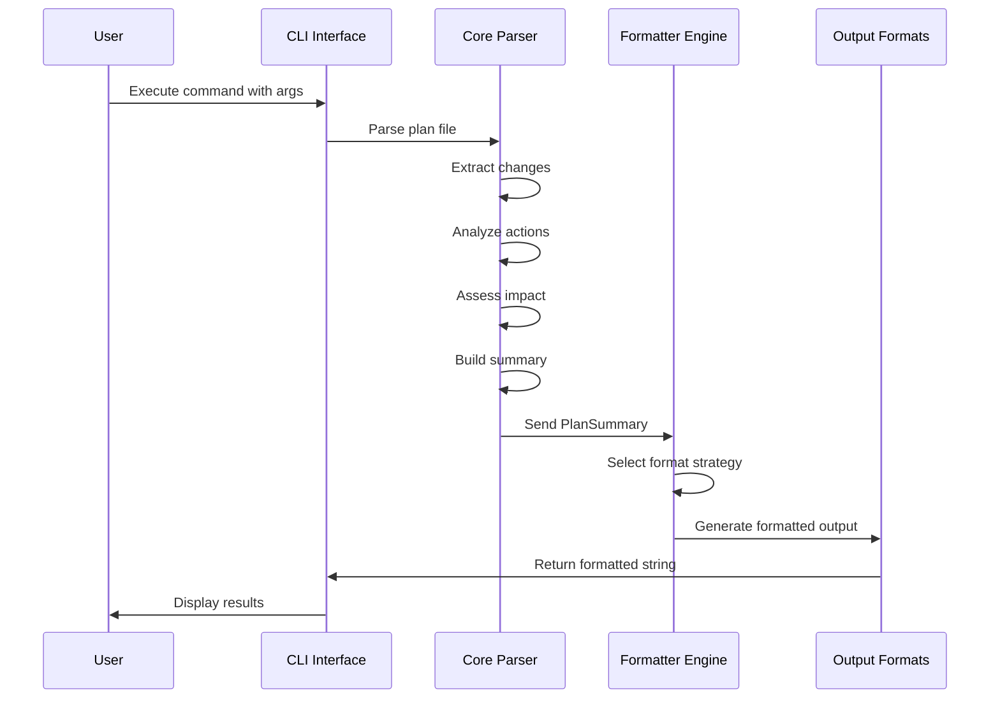
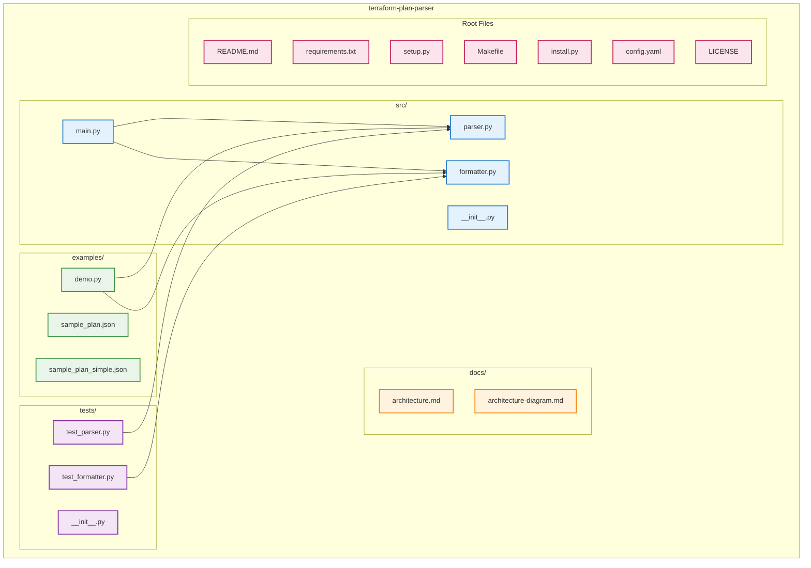
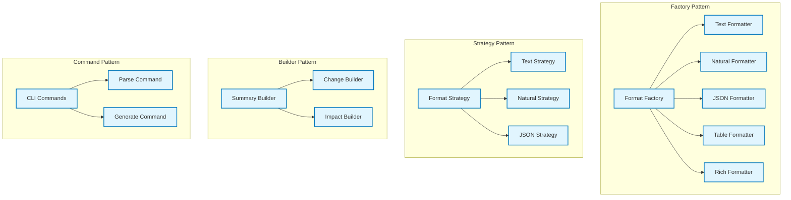
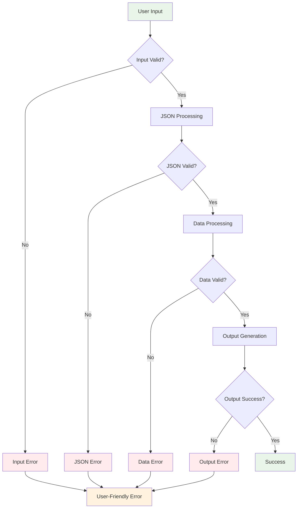
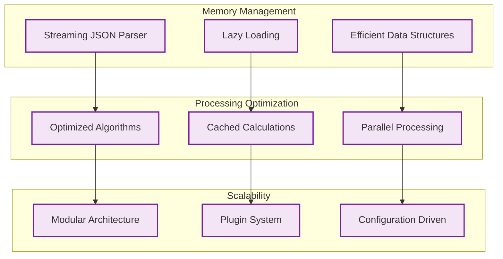

# 🏗️ Terraform Plan Parser - Visual Architecture

## 📊 System Architecture Diagram

## 🔄 Data Flow Diagram

## 🧩 Component Interaction Diagram

## 📁 Project Structure Diagram

## 🎯 Design Patterns Diagram

## 🔒 Error Handling Flow

## 🚀 Performance Architecture

These diagrams provide a comprehensive visual representation of the Terraform Plan Parser architecture, making it easy to understand the system's structure, data flow, and design patterns. 🏗️ 